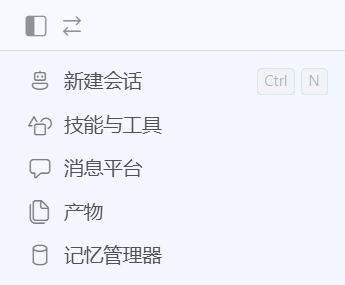
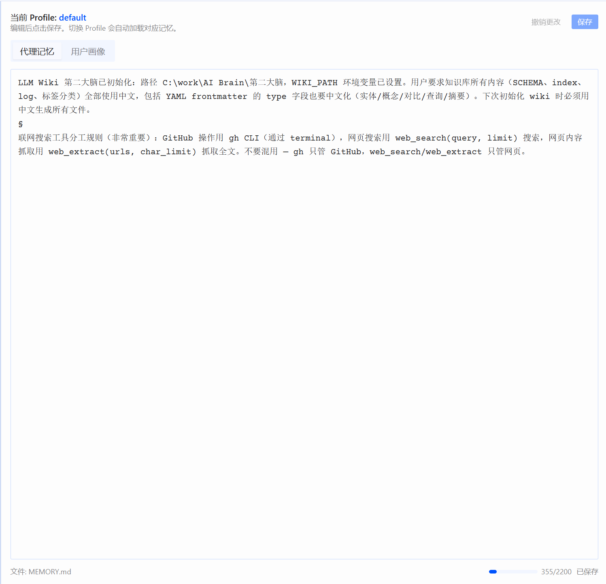

# Hermes Memory Manager

[](https://github.com/NousResearch/hermes-agent)
[](LICENSE)
[]()

A desktop plugin for [Hermes Agent](https://github.com/NousResearch/hermes-agent) that lets you view and edit your agent's **MEMORY.md** and **USER.md** directly from the desktop UI — with automatic profile switching.

> **No more `cat ~/.hermes/memories/MEMORY.md` in the terminal.** Open the sidebar, edit, and save — that's it.

---

## Features

- **Sidebar entry** — one click to open the memory editor
- **Tabbed editing** — switch between **Agent Memory** and **User Profile**
- **Profile-aware** — switch profiles in the desktop, memory content follows automatically
- **Safe saves** — creates `.bak` backup before every write
- **Unsaved change detection** — warns before switching tabs with dirty state
- **Command palette** — press `Ctrl+K` and search "Open Memory Manager"
- **Character counter + progress bar** — shows usage against your configured char limit

---

## Screenshots

| Sidebar Entry | Memory Editor |
|---------------|---------------|
|  |  |

> Click **Memory Manager** in the left sidebar to open the memory editor, where you can view and edit **Agent Memory** / **User Profile** with automatic multi-profile switching.

---

## Installation

### One-liner (recommended)

**Windows (PowerShell 5+)**

```powershell
irm https://raw.githubusercontent.com/TBAOT/hermes-memory-manager/main/install.ps1 | iex
```

**Linux / macOS**

```bash
curl -fsSL https://raw.githubusercontent.com/TBAOT/hermes-memory-manager/main/install.sh | bash
```

The installer will:

1. Place backend files → `<HERMES_HOME>/plugins/memory-manager/dashboard/`
2. Place desktop plugin → `<HERMES_HOME>/desktop-plugins/memory-manager/plugin.js`
3. Enable the plugin in `config.yaml` (`hermes plugins enable memory-manager`)
4. Prompt you to restart Hermes Desktop

### Manual installation

```bash
# 1. Backend
mkdir -p ~/.hermes/plugins/memory-manager/dashboard
cp python/dashboard/{manifest.json,plugin_api.py} ~/.hermes/plugins/memory-manager/dashboard/

# 2. Desktop plugin
mkdir -p ~/.hermes/desktop-plugins/memory-manager
cp desktop/plugin.js ~/.hermes/desktop-plugins/memory-manager/

# 3. Enable
hermes plugins enable memory-manager

# 4. Restart the gateway
hermes gateway restart
```

---

## Usage

1. **Launch** Hermes Desktop
2. Click **Memory Manager** (database icon) in the left sidebar, or press `Ctrl+K` and search "Open Memory Manager"
3. Switch between **Agent Memory** / **User Profile** tabs
4. Edit freely — click **Save** to persist (a `.bak` copy is kept alongside)
5. Switch profiles from the top bar — content reloads automatically

---

## Project Structure

```
hermes-memory-manager/
├── python/
│   └── dashboard/
│       ├── manifest.json          # Dashboard plugin manifest
│       └── plugin_api.py          # FastAPI router (GET/POST /content, GET /profile)
├── desktop/
│   └── plugin.js                  # Desktop runtime plugin (route, sidebar, palette)
├── scripts/
│   └── link-plugins-api-to-profiles.ps1   # Multi-profile support
├── install.ps1                    # Windows installer
├── install.sh                     # Unix installer
└── README.md
```

---

## Multi-Profile Support

Hermes uses **profiles** (separate config/memory directories for different contexts). When you use the plugin with `hermes serve --profile <name>`, the dashboard server looks for plugins in that profile's directory.

To make the plugin available across **all** your profiles, run the helper script **once** after installation:

**Windows:**

```powershell
powershell -ExecutionPolicy Bypass -File scripts\link-plugins-api-to-profiles.ps1
```

**Linux / macOS** (requires `ln -s` per profile):

```bash
for p in ~/.hermes/profiles/*/; do
  ln -sfn ~/.hermes/plugins "$p/plugins"
done
```

> **New profile?** Just re-run the script. It creates junction/symlink from each profile's `plugins/` directory to the default one.

---

## API Routes

| Method | Path | Description |
|--------|------|-------------|
| GET | `/api/plugins/memory-manager/content` | Returns `{memory, user}` strings |
| POST | `/api/plugins/memory-manager/content` | Saves `{memory?, user?}` (only provided keys) |
| GET | `/api/plugins/memory-manager/profile` | Returns `{profile, hermes_home, memory_dir}` |

All routes are profile-aware — `get_hermes_home()` resolves to the active profile's directory automatically.

---

## Uninstall

```bash
hermes plugins disable memory-manager
rm -rf ~/.hermes/plugins/memory-manager
rm -rf ~/.hermes/desktop-plugins/memory-manager
hermes gateway restart
```

---

## Development

- **Desktop plugin** is hot-reloaded: edit `plugin.js`, save, and the changes apply immediately — no restart needed.
- **Backend API** requires a gateway restart: `hermes gateway restart` (or restart Hermes Desktop).
- The plugin uses the Hermes Plugin SDK (`@hermes/plugin-sdk`) — available imports: `host`, `useValue`, `useQuery`, `Button`, `Textarea`, `Loader`, etc.

---

## Compatibility

- Hermes Agent Desktop (supports `desktop-plugins/` runtime plugin system)
- Python 3.10+ (FastAPI + Pydantic v2, bundled with Hermes)
- Windows / Linux / macOS

---

## License

MIT
